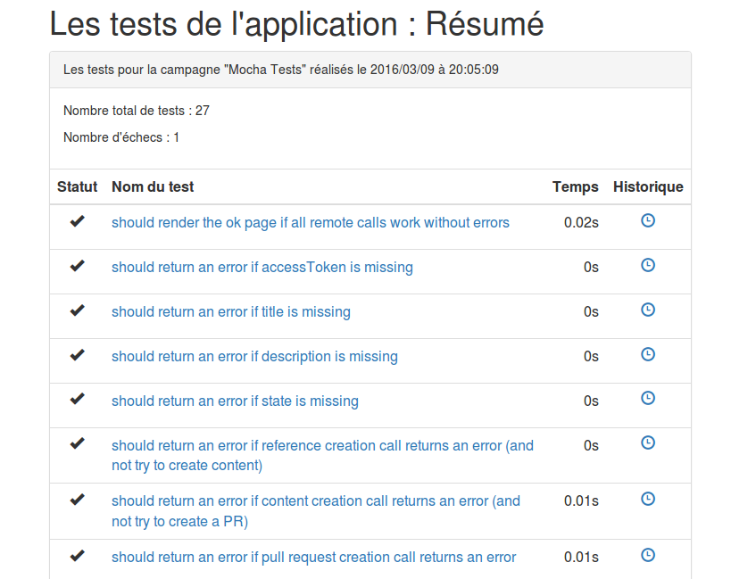
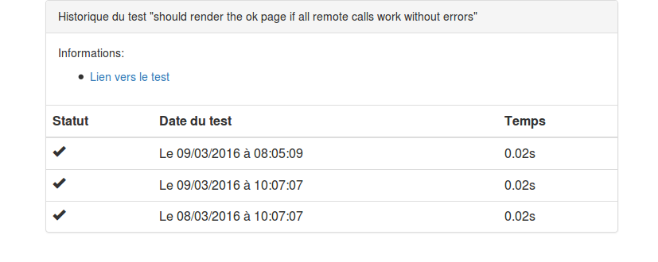

# Qu'est-ce que c'est ?

Ludwig outille la proposition de corrections d'une application web par des utilisateurs et des experts métier.

## Pour les contributeurs

Ludwig minimise le temps passé à proposer des corrections sur une fonctionnalité et facilite le dialogue avec les développeurs.

## Pour les développeurs

On s'appuie sur Github et ses APIs pour minimiser les outils. Ludwig simplifie la gestion des suggestions en s'appuyant sur les _pull requests_.

# De quoi est composé Ludwig?

Ludwig comprend deux composants :

* le widget navigateur ;
* l'application.

Le widget peut s'utiliser seul pour certaines fonctionnalités, mais prend surtout son intérêt couplé à l'application.

## Que fait le widget navigateur ?

Le widget est là pour simplifier la collecte d'informations fonctionnelles pour créer des tests pour l'application qui intègre le widget.

## Que fait l'application ?

L'application, quant à elle, permet de faire le lien entre le widget et GitHub (pour certaines fonctionnalités nécessitant une utilisation authentifiée de l'API GitHub, par exemple).
Elle permet aussi d'aggréger les résultats de tests fonctionnels de l'application (au format xUnit) et de les présenter aux utilisateurs.

Exemple de fiche résumée :


Exemple de détail pour un test (historique) :


# Installation

## Pré-requis

Pour installer Ludwig et le lancer, vous aurez besoin de :

* [NodeJS/NPM](https://nodejs.org)
* [MongoDB](http://www.mongodb.org)

## Utiliser le widget dans une application

### Configurer le widget

Le widget s'instancie avec en unique paramètre un objet contenant les informations nécessaires pour joindre le dépôt Github de votre projet. Il faut donc s'occuper de cette configuration avant de déployer le widget.
Le plus simple est de se baser sur le fichier `ludwig-conf.js` (le serveur et le widget partagent le même fichier de configuration), puis d'exécuter `npm run build` à la racine du répertoire de l'application. Un fichier `bundle.js` est généré. Il contient le widget.

_Note :_ Cette configuration est packagée avec le widget à distribuer, il est inutile de la charger à part.

#### Détail des entrées du fichier de configuration du widget

* `repoUrl` : l'URL Github principale du dépôt de l'application
* `template` : un template (URLencoded) à utiliser pour remplir le fichier créé avec la suggestion
* `prefix` : préfixe du fichier qui sera créé lors de la suggestion
* `ludwigCreateSuggestionURL` : l'URL Ludwig à joindre pour créer une suggestion en passant par les APIs authentifiées GitHub
* `web`
    * `acceptedTestsPath` : l'URL où l'on peut consulter les tests acceptés par l'équipe
    * `addPath` : suffixe d'URL accolé à repo_url pour ajouter une nouvelle demande
    * `suggestedTestsPath` : l'URL qui présente les suggestions non validées
* `commitReferenceToBranchFrom` :
* `github` (configuration pour appeler les APIs GitHub)
    * `callback_url`:  l'URL de callback configurée dans le repo qui contient les tests de sorte à ce que Ludwig puisse en modifier le contenu (et créer des Pull Requests)
    * `apiEndpoints`
        * `createRef` : création d'une nouvelle référence [https://developer.github.com/v3/git/refs/](https://developer.github.com/v3/git/refs/)
        * `createContent` : création d'un nouveau fichier [https://developer.github.com/v3/repos/contents/](https://developer.github.com/v3/repos/contents/)
        * `createPullRequest` : création d'une pull request [https://developer.github.com/v3/pulls/](https://developer.github.com/v3/pulls/)
* `mongo`
    * `uri` : l'URI de la base de données où seront stockées les informations de session et les suites de tests
    * `options` : éventuelles options à passer à mongoose (comme indiqué [ici](http://mongoosejs.com/docs/connections.html))

_Note :_ Le fichier `ludwig-conf-sample.js` se trouve à la racine du projet.

### Ajouter le widget

L'application peut embarquer le widget directement ou se le faire servir par le backend Ludwig. Dans le premier cas, il faut que l'application embarque le fichier `bundle.js` généré dans l'étape précédente. Dans le second cas on va retrouver ce fichier à `$URL_DE_L_APPLI/bundle.js`.

```html
<script type="text/javascript" src="http://url.ludwig/bundle.js" charset="utf-8">
```

Une fois cet ajout fait, le widget est disponible sous le nom `Ludwig` (qui est une classe, pour accéder aux fonctionnalités, il faut donc l'instancier en passant par un `new Ludwig(configuration)`, avec `configuration` un objet contenant la configuration du widget se basant sur l'exemple fourni par `ludwig-conf-sample.js`)

### L'API du widget
Le widget doit être initialisé avec sa configuration pour les diverses URLs à appeler pour une tâche ou l'autre. La configuration suit la même organisation que celle côté serveur.

Aujourd'hui, le widget met à disposition plusieurs fonctions :

* `generateSuggestionURL(currentState, expectedResult [, customSuggestionFormatter] )` : Génère une URL permettant d'ajouter un fichier correspondant à une suggestion. L'état collecté par l'application ainsi que le résultat attendu seront sérialisés dans la requête.
Il est possible de préciser à la méthode une fonction personnalisée pour sérialiser le template, l'état et le résultat attendu. Cette fonction doit prendre 3 paramètres et renvoyer une chaîne de caractères (qui sera ensuite échappée par Ludwig)
* `generateSuggestionName()` : Génère un nom de suggestion qui se base sur le préfixe configuré et la date courante.
* `acceptedTestsURL()` : Génère l'URL permettant d'accéder à la liste des tests acceptés.
* `suggestedTestsURL()` : Génère l'URL permettant de consulter les suggestions de tests.
* `generateLudwigSuggestionEndpointURL(suggestionTitle, suggestionDescription, currentState, expectedResult)` : Crée le lien qui permet de contacter l'API Ludwig pour créer une nouvelle suggestion. Cela permet de fournir un titre et une description en plus de l'état et du résultat attendu.

## Configurer et lancer le serveur Ludwig

### Configurer

Le fichier de configuration utilisé par l'API se trouve à la racine. Il permet de configurer les endpoints de l'API Github à utiliser.

La configuration des clefs d'API github se fait par `npm config`. Il faut saisir les clefs suivantes :

* ludwig:clientID : Client ID à utiliser pour requêter l'API GitHub
* ludwig:clientSecret : Client Secret à utiliser pour requêter l'API GitHub

Deux autres paramètres sont configurés par clefs de configuration NPM :

* ludwig:sessionSecret : Le secret qui sera utilisé pour les cookies de session
* ludwig:AccessControlAllowOrigin : Le paramétrage CORS de l'application (pour permettre que l'application qui intègre le widget puisse interagir avec l'instance Ludwig, par exemple)

Pour automatiser l'enregistrement de toutes les clefs de pconfiguration npm, un script est disponible dans `./scripts/setupNPMVariables.sh`

### Lancer

C'est une application NodeJS qui ne demande rien de particulier. Une fois ses dépendances installées, Ludwig peut ensuite être démarré comme bon vous semble :

**Attention**, il faut avoir créé les **fichiers de configuration du widget et de l'API avant** de dérouler ces étapes.

```
user@host$ npm install # installer / packager
user@host$ npm start
user@host$ node server.js
user@host$ pm2 start pm2.conf.json
```

### Consulter le rapport des derniers tests

#### Description générale
Il est possible d'alimenter une base de données avec des rapports de tests afin de présenter aux contributeurs l'état des tests de l'application et son historique.

Pour pouvoir visualiser ces rapports, il faut tout d'abord alimenter la base de données de l'application. Cela se fait en utilisant l'utilitaire d'alimentation :

```
user@host$ npm run insertTestReportData <fichier.xunit.xml>
```

Pour l'instant Ludwig accepte les rapports au format xUnit avec une suite de tests à la racine. Pour éviter d'insérer deux fois le même rapport, on considère que la propriété "timestamp" de la suite de tests est une clef unique (et l'importeur déclenchera une erreur si l'on tente d'insérer deux rapports avec le même timestamp, ce qui semble être une approche raisonnable pour un unique projet).

#### Où trouver ce rapport ?

Le rapport peut être trouvé à l'adresse suivante : `/listTests`.

#### Comment générer un rapport pour Ludwig ?

Pour l'instant, les rapports que Ludwig est capable de traiter doivent suivre le format xUnit (avec un bloc testsuite juste sous la racine). Quelques consignes pour profiter des fonctionnalités comme le lien direct vers le fichier source d'un test :

Pour déterminer l'URL du fichier source d'un test, Ludwig se base sur :

* L'URL de base du dépôt où se trouvent les tests (dans la configuration c'est la propriété `baseUrl`).
* Le chemin permettant d'atteindre, sur le dépôt, le répertoire contenant les fichiers de test.
* Le nom du fichier de test lié au test à consulter doit être renseigné dans l'attribut `classname` de chacun des cas de test.

Les informations générales (tests ok, en échec, date des tests, temps pris par la campagne de tests…) se trouvent dans les propriétés de la suite de tests.

* `name` : Le nom de la campagne de test
* `time` : Le temps pris par tous les tests
* `timestamp` : L'heure à laquelle la campagne de tests s'est terminée
* `tests` : Le nombre total de tests
* `errors` : Les tests en erreur (cassés, le problème est technique)
* `failures` : Les échecs (les tests ont échoué car le comportement observé n'est plus celui attendu par les tests)

## Notes sur la configuration

En l'état, vous devez créer les fichiers de configuration du widget et de l'API (dont un example, `ludwig-conf-sample.js` est fourni à la racine), le serveur d'API refusera de démarrer sans sa configuration.

Le fichier `sample` est là pour qu'il ne reste plus qu'à remplir les blancs et le renommer pour avoir une configuration qui permette de packager / démarrer.

## Tester l'API

Il existe aujourd'hui une page qui permet de directement tester l'API dans un navigateur, elle est exposée dans `/test`.
